<div align="center">

# 🏦 Financial RAG Engine

### A Production-Grade AI Research Copilot for Financial Documents

*FastAPI · OpenAI · Pinecone · FlashRank · Redis · Ragas*

[](https://python.org)
[](https://fastapi.tiangolo.com)
[](https://openai.com)
[](https://pinecone.io)
[](https://redis.io)

</div>

---

## Problem Statement

Financial analysts spend hours manually searching through 10-K annual reports, earnings call transcripts, and SEC filings. Keyword search is brittle and prone to missing context. 

The Financial RAG Engine is a full-stack AI system that parses, contextualizes, embeds, and reasons over complex financial documents. By leveraging Retrieval-Augmented Generation (RAG), it allows users to have natural, grounded conversations with their financial data, ensuring answers are derived strictly from retrieved document evidence to eliminate hallucinations.

## Architecture



### Ingestion Pipeline
- **PDF Parsing:** Extracts raw text and preserves financial tables (pymupdf4llm).
- **Semantic Chunker:** Splits markdown into overlapping chunks.
- **Contextual Enrichment:** LLM generates a 2-sentence context summary and prepends it to each chunk before embedding.
- **Embeddings:** Enriched chunks are converted to 1,536-dimensional vectors (text-embedding-3-small).
- **Vector DB:** Vectors and metadata are stored serverlessly (Pinecone).

### Retrieval & Generation Pipeline
1. **Query Router:** Classifies messages (rag, small_talk, off_topic).
2. **Pronoun Resolution & Query Expansion:** Resolves context (e.g., "it" to "NVIDIA") and expands into search variants.
3. **Semantic Cache Lookup:** Returns identical questions from Redis in ~100ms.
4. **Embedding:** Embeds query variants.
5. **Bi-Encoder Search:** Fetches candidate chunks from Pinecone.
6. **Cross-Encoder Re-ranking:** Locally re-ranks candidates (FlashRank) to the top 5.
7. **Self-RAG Grading:** Evaluates context sufficiency; rewrites query if needed.
8. **Answer Generation:** Generates grounded answers based on retrieved context.

## Evaluation Results

| Metric | Description | Benchmark Score | Target |
|---|---|---|---|
| **Faithfulness** | Does the answer contain only facts from the retrieved context? | 1.0 | ≥ 0.95 |
| **Answer Relevancy** | Is the answer addressing the question asked? | ~0.93 | ≥ 0.90 |
| **Context Recall** | Did we retrieve all chunks needed to answer correctly? | 1.0 | ≥ 0.90 |
| **Context Precision** | Are the retrieved chunks relevant to the question? | - | ≥ 0.80 |

*(Benchmarked on a 5-question NVIDIA 10-K test set using Ragas)*

## Tech Stack

- **Backend API:** FastAPI + Uvicorn
- **LLM:** OpenAI gpt-4o-mini
- **Embeddings:** OpenAI text-embedding-3-small
- **Vector DB:** Pinecone Serverless
- **Re-ranker:** FlashRank (ms-marco-MiniLM-L-12-v2)
- **Semantic Cache:** Redis Cloud + NumPy
- **Evaluation:** Ragas + LangChain
- **PDF Parsing:** pymupdf4llm
- **Rate Limiting:** slowapi

## Project Structure

```text
financial_RAG/
├── main.py                    # FastAPI app, API endpoints
├── run.py                     # Server launcher
├── evaluate.py                # Ragas evaluation script
├── config/
│   └── settings.py            # Environment variable validation
├── services/
│   ├── document_processor.py  # PDF → Markdown → chunks
│   ├── embedding_service.py   # Text → vectors
│   ├── pinecone_service.py    # Vector DB storage & search
│   ├── reranker_service.py    # Cross-Encoder re-ranking
│   ├── llm_service.py         # Router, resolver, expander, generator
│   └── semantic_cache.py      # Redis-backed cache
├── static/
│   ├── index.html             # App UI
│   ├── style.css              # Styling
│   └── app.js                 # Frontend logic
├── .env                       # API Keys
└── requirements.txt           # Dependencies
```

## How to Run

### Prerequisites
- Python 3.10+
- OpenAI API Key
- Pinecone API Key
- Redis Cloud (optional)

### Setup

```bash
cd financial_RAG
python -m venv venv

# Windows:
.\venv\Scripts\Activate.ps1
# Mac/Linux:
source venv/bin/activate

pip install -r requirements.txt
```

Create a `.env` file in the project root:
```env
OPENAI_API_KEY=sk-your-openai-key-here
PINECONE_API_KEY=your-pinecone-key-here
PINECONE_INDEX_NAME=financial-rag
# Optional: REDIS_HOST, REDIS_PORT, REDIS_USERNAME, REDIS_PASSWORD
```

### Start the Server

```bash
# Development
uvicorn main:app --reload

# Production
python run.py prod
```

Navigate to `http://localhost:8000`

## API Reference

| Endpoint | Method | Rate Limit | Description |
|---|---|---|---|
| `GET /` | GET | — | Serves the frontend UI |
| `GET /health` | GET | — | Server health check |
| `POST /ingest` | POST | 5/min | Upload a PDF for ingestion |
| `POST /search` | POST | 30/min | Ask a question with optional conversation history |
| `POST /evaluate` | POST | 2/min | Run Ragas evaluation on test cases |

## Key Design Decisions

### Pronoun Resolution at Retrieval Time
Most RAG systems only use conversation history during answer generation. We resolve pronouns at the expansion stage before embedding, so retrieval is also context-aware.

### Resolved Queries in Semantic Cache
Caching the resolved query ("how is NVIDIA doing?" vs "how is Apple doing?") makes each entry entity-specific and collision-free, avoiding incorrect cache hits.

### 0.92 Cache Similarity Threshold
- < 0.90: Too aggressive (different questions match)
- 0.92: Semantically equivalent questions match
- > 0.95: Too strict (nearly identical phrasing required)

### Embedding Model Selection (`text-embedding-3-small` vs. Financial Models)
While finance-specific models (like FinBERT or domain-specific fine-tunes of BAAI/bge-m3) excel at capturing niche financial vocabulary, OpenAI's `text-embedding-3-small` was selected for the production environment due to the following considerations:
- **Cost & Latency:** Exceptional API speed and very low cost per token, which is critical for real-time user query resolution and large-scale document ingestion.
- **Zero-Shot Generalization:** It provides state-of-the-art dense representations that often match or outperform older domain-specific models, especially when bridging natural, conversational user queries with dense 10-K document chunks.
- **The Trade-off:** The primary trade-off is vendor lock-in and potentially sacrificing a slight edge in ultra-niche financial terminology compared to a custom locally-hosted model. We mitigate this by using a robust cross-encoder re-ranking step (FlashRank) downstream to ensure high precision on the final retrieved context.

### Chunking Strategy (Recursive Character vs. Semantic/Table Parsing)
While specialized table parsers or markdown-aware chunkers are often recommended for financial documents to prevent tables from being split mid-row, we rely on a standard `RecursiveCharacterTextSplitter` (1,000 chars, 200 char overlap). This is highly efficient and robust because we employ **Contextual Retrieval**. 
- **The Problem with Naive Chunking:** Splitting a large financial table usually separates numeric rows from their column headers, stripping the data of its semantic meaning in a standard RAG system.
- **The Contextual Retrieval Solution:** Before embedding, an LLM generates a 2-sentence summary for each chunk using the full document as context. If a table is split, the injected context explicitly describes the raw rows (e.g., *"This chunk is a continuation of the Q3 Income Statement table for Apple, detailing operating expenses."*). 
- **The Result:** The structural and hierarchical context is restored directly in the text. This allows the embedding model and the generator LLM to perfectly understand isolated table rows, eliminating the need for brittle, computationally expensive table-parsing logic while maintaining state-of-the-art retrieval accuracy for structured data.

### Self-RAG Feedback Loop
The system employs a Self-RAG grader to evaluate retrieved context before generating a final answer. 
- **Retry Limit:** It allows a maximum of 2 retrieval attempts (i.e., 1 retry). If the initial context is graded as 'insufficient', an LLM rewrites the query using different vocabulary for a second attempt.
- **Exhausted Retries (Edge Case):** If the context is still graded as 'insufficient' after the maximum attempts, the system does not crash or return a hard error. Instead, it proceeds to the generation phase using the "best available context" from the final attempt. The generator LLM's system prompt is explicitly designed for this edge case: it is instructed to gracefully explain exactly what requested information is missing from the documents, while summarizing any tangentially related information that *was* found.
